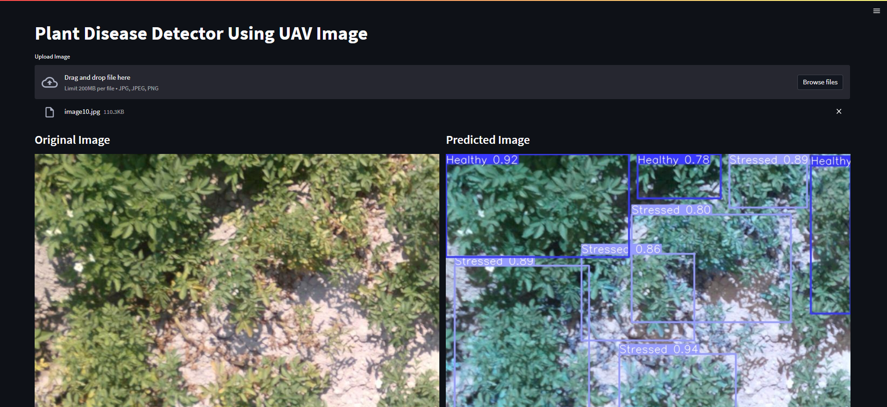

# UAVPlantDiseaseDetectection

Created a Web application using streamlit to classify and detect whether Russet Burbank potato plants is drought stressed caused by premature plant senescence or healthy. The data Image taken from an UAV and was around 300 which were augemented to increase it around 1500 images. Used four different types of object detection models- YOLOv8, SSD, Faster-RCNN, Mask-RCNN. Compared and analysed the performace of these four models to find the most accurate. The models were validated using Vegetative Indexes like NDVI, DVI and GVDI.

The Full details of the Project is given in the Report PDF

